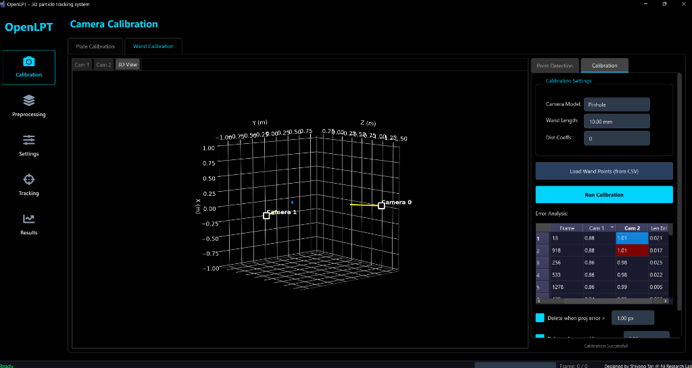

# Wand Calibration User Guide

This guide walks you through the camera calibration process using a calibration wand in OpenLPT. The process consists of two main stages: **Point Detection** and **Calibration**.

## 1. Point Detection

First, select the **Wand Calibration** tab and ensure you are on the **Point Detection** sub-tab.

### Step 1: Configure Settings
Set the detection parameters in the **Detection Settings** panel on the right:
- **Num Cameras**: Enter the number of cameras in your setup (e.g., `2`).
- **Wand Type**: Choose **Dark on Bright** (dark balls on a bright background) or **Bright on Dark**.
- **Radius Range**: Adjust the slider to cover the expected radius (in pixels) of the wand balls in your images (e.g., `45` to `120`).
- **Sensitivity**: Set the detection sensitivity (default is around `0.85`).

### Step 2: Load Camera Images
In the **Camera Images** table:
1.  For each **Cam ID**, load the corresponding folder of calibration images (click the cell or a load button if available).
2.  Enter the initial **Focal Length (px)** (e.g., `9000`).
3.  Enter the detection **Width** and **Height** (e.g., `1280` x `800`).

### Step 3: Verify and Process
1.  Select a frame from the **Frame List**.
2.  Click **Test Detect (Current Frame)**.
    *   *Verification*: Look at the image view on the left. You should see **green circles** identifying the two balls on the wand. If not, adjust the *Radius Range* or *Sensitivity*.
3.  Once satisfied with the detection test, click **Process All Frames / Resume** to detect points in all loaded images.

---

## 2. Calibration

After extracting points, switch to the **Calibration** sub-tab.

### Step 4: Calibration Settings
Configure the physical model in **Calibration Settings**:
- **Camera Model**: Select **Pinhole** (standard).
- **Wand Length**: Enter the exact physical distance between the centers of the two wand balls (e.g., `10.00 mm`). **Accurate measurement is critical.**
- **Dist Coeffs**: Number of distortion coefficients to optimize (typically `0` for initial testing, or higher for complex lenses).

### Step 5: Run Optimization
1.  Click the blue **Run Calibration** button.
2.  The system will optimize the camera parameters. The **3D View** on the left will visualize the camera positions and wand points.

### Step 6: Analyze & Filter Errors
Review the **Error Analysis** table:
- **Reprojection Error (Cam 1, Cam 2, ...)**: Ideally less than 1.0 pixel (blue/normal). High errors (red) indicate outliers.
- **Length Error (Len Err)**: deviation from the specified wand length.

**Refinement:**
- Mark valid/bad frames in the table.
- Use the **Delete when proj error > [X] px** button to automatically remove frames with high reprojection errors (e.g., `1.00 px`).
- **Re-run Calibration** after filtering to improve accuracy.

### Step 7: Save Results
When the "Calibration Successful" message appears (or upon completion), you can save the resulting intrinsic and extrinsic parameters for usage in 3D tracking.
